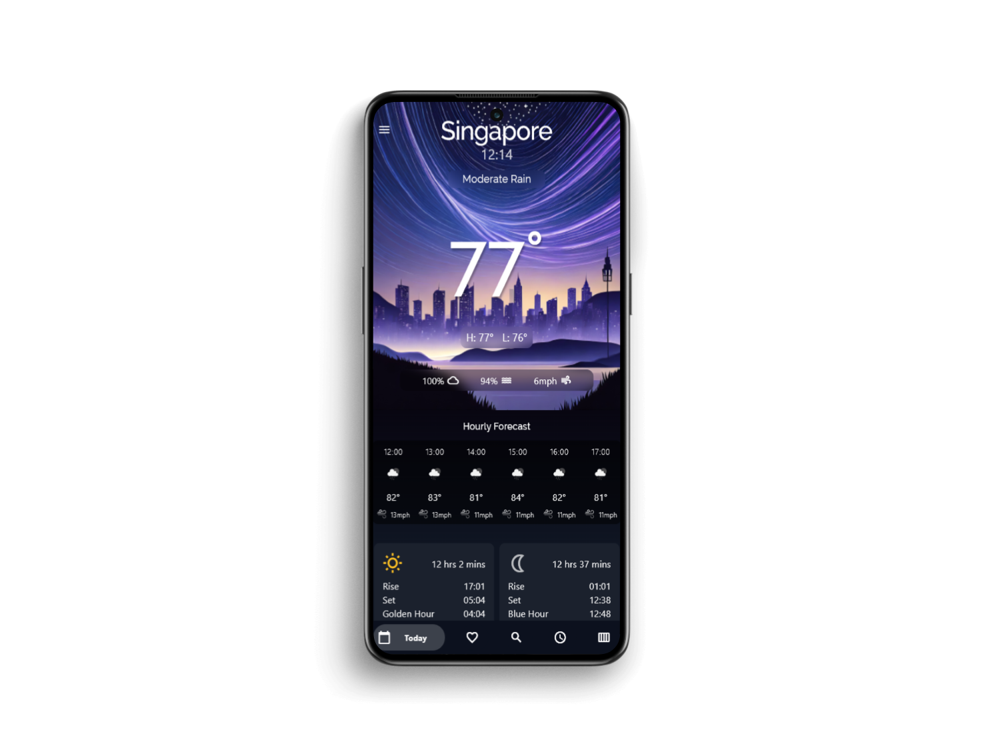
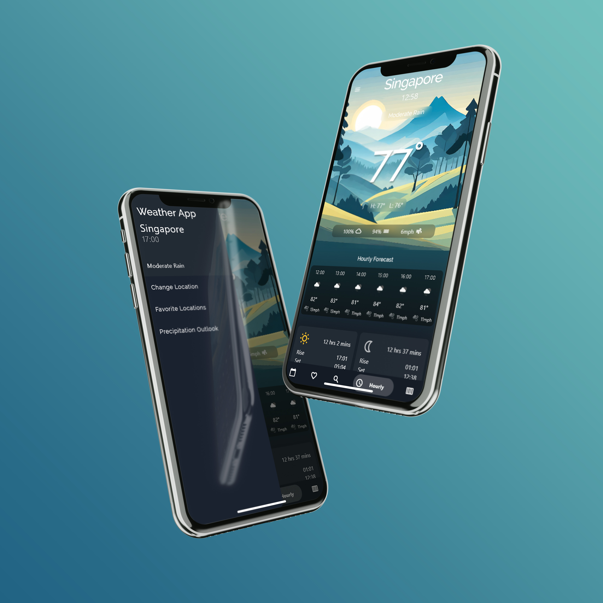
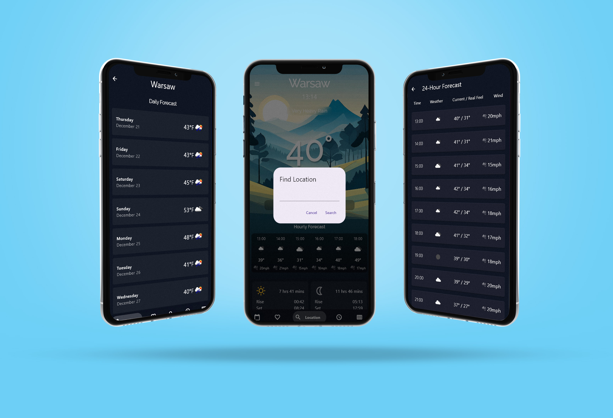
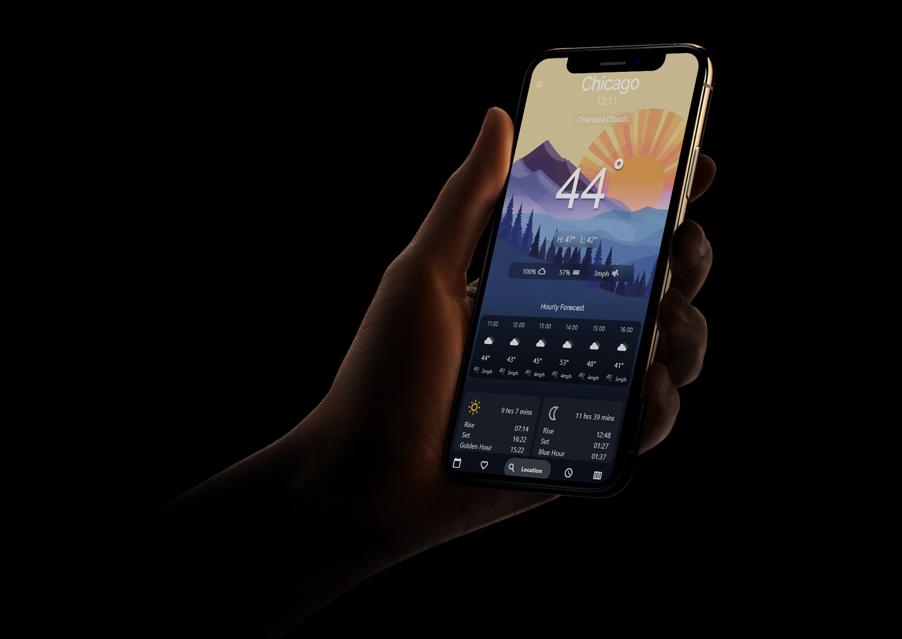

<br/>
<p align="center">
  <a href="https://github.com/lifeOfKamil/Flutter-Weather-App">
    
  </a>

  <h3 align="center">Flutter Weather App</h3>

  <p align="center">
    A sleek weather app with OpenWeatherMap integration, a user-friendly UI, and precise weather forecasts.
    <br/>
    <br/>
    <a href="https://github.com/lifeOfKamil/Flutter-Weather-App"><strong>Explore the docs »</strong></a>
    <br/>
    <br/>
    <a href="https://github.com/lifeOfKamil/Flutter-Weather-App">View Demo</a>
    .
    <a href="https://github.com/lifeOfKamil/Flutter-Weather-App/issues">Report Bug</a>
    .
    <a href="https://github.com/lifeOfKamil/Flutter-Weather-App/issues">Request Feature</a>
  </p>
</p>

## Table Of Contents

- [About the Project](#about-the-project)
- [Built With](#built-with)
- [Getting Started](#getting-started)
  - [Installation](#installation)
- [Usage](#usage)
- [Roadmap](#roadmap)
- [Contributing](#contributing)
- [License](#license)
- [Authors](#authors)
- [Acknowledgements](#acknowledgements)

## About The Project



Hi there! I'm Kamil Lepkowski, a passionate developer who developed this sleek, user-friendly weather using Flutter and Dart.

This app was initially inspired by my mobile development class where our final project required a dynamic application that stored data locally and utilized an API. Once the semester concluded, I decided to build out the app a bit more after sketching a new UI in Figma for it.

This project seamlessly integrates real-time weather data from OpenWeatherMap providing dynamic UI components for today's weather and hourly and daily forecasts. With features such as location search and favorite location saving, I aimed to deliver an intuitive and informative weather experience.

Check out the code, explore the weather widgets, and enjoy the simplicity of checking the forecast with my Flutter Weather App!

A list of commonly used resources that I find helpful is listed in the acknowledgments.

## Built With

- [Flutter](https://flutter.dev/) - Google's UI toolkit for building natively compiled applications.
- [Dart](https://dart.dev/) - Programming language optimized for building mobile, desktop, server, and web applications.
- [OpenWeatherMap API](https://openweathermap.org/api) - API for accessing real-time weather data.

## Getting Started

To get a local copy up and running follow these simple example steps.

### Installation

1. Get a free API Key at [openweathermap.org/api](https://openweathermap.org/api)
   <sub><sup>\* This project utilizes the student version of the API to access certain data<sub><sup>

2. Clone the repo

```sh
    git clone https://github.com/lifeOfKamil/Flutter-Weather-App.git
```

3. Navigate to the project directory

```sh
    cd your-repo
```

4. Install dependencies

```sh
    flutter pub get
```

5. Enter your API key:

- Open the 'lib/services/weather_api.dart' file
- Replace 'const String apiKey = 'YOUR_API_KEY';' with your actual API key.

6. Run the app

```sh
    flutter run
```

Feel free to reach out if you encounter any issues or have questions.

## Usage

Here are some additional screenshots and mockup:


<br></br>

<br></br>


## Roadmap

See the [open issues](https://github.com/lifeOfKamil/Flutter-Weather-App/issues) for a list of proposed features (and known issues).

## Contributing

Contributions are what make the open source community such an amazing place to be learn, inspire, and create. Any contributions you make are **greatly appreciated**.

- If you have suggestions for adding or removing projects, feel free to [open an issue](https://github.com/lifeOfKamil/Flutter-Weather-App/issues/new) to discuss it, or directly create a pull request after you edit the _README.md_ file with necessary changes.
- Please make sure you check your spelling and grammar.
- Create individual PR for each suggestion.
- Please also read through the [Code Of Conduct](https://github.com/lifeOfKamil/Flutter-Weather-App/blob/main/CODE_OF_CONDUCT.md) before posting your first idea as well.

### Creating A Pull Request

1. Fork the Project
2. Create your Feature Branch (`git checkout -b feature/NewFeature`)
3. Commit your Changes (`git commit -m 'Add some NewFeature'`)
4. Push to the Branch (`git push origin feature/NewFeature`)
5. Open a Pull Request

## License

Distributed under the MIT License. See [LICENSE](https://github.com/lifeOfKamil/Flutter-Weather-App/blob/main/LICENSE.md) for more information.

## Authors

- **Kamil Lepkowski** - _Computer Science Student_ - [Kamil Lepkowski](https://github.com/lifeOfKamil) - _Built Dart/Flutter Weather App_

## Acknowledgements

I would like to express my gratitude to the following:

- **Flutter and Dart Community:**
  Thank you to the vibrant and supportive Flutter and Dart communities for sharing knowledge and insights, making the development process smoother.

- **OpenWeatherMap:**
  A special thanks to OpenWeatherMap for providing the weather data API, enabling real-time weather updates in this project.

- **Package Contributors:**
  I appreciate the efforts of the contributors to the following Flutter packages:

      * [http](https://pub.dev/packages/http)
      * [shared_preferences](https://pub.dev/packages/shared_preferences)
      * [intl](https://pub.dev/packages/intl)
      * [bottom_navy_bar](https://pub.dev/packages/bottom_navy_bar)
      * [fl_chart](https://pub.dev/packages/fl_chart)
      * [flutter_svg](https://pub.dev/packages/flutter_svg)

These packages greatly enhanced the functionality and aesthetics of the app.

If you made it this far, thank you again for checking out my app!
